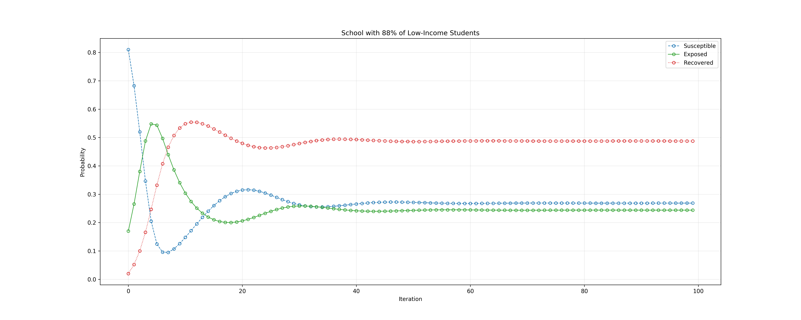
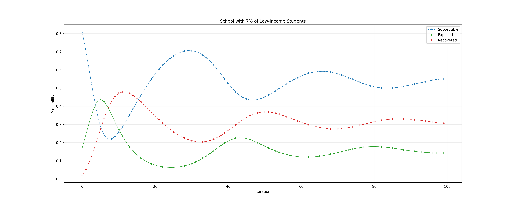
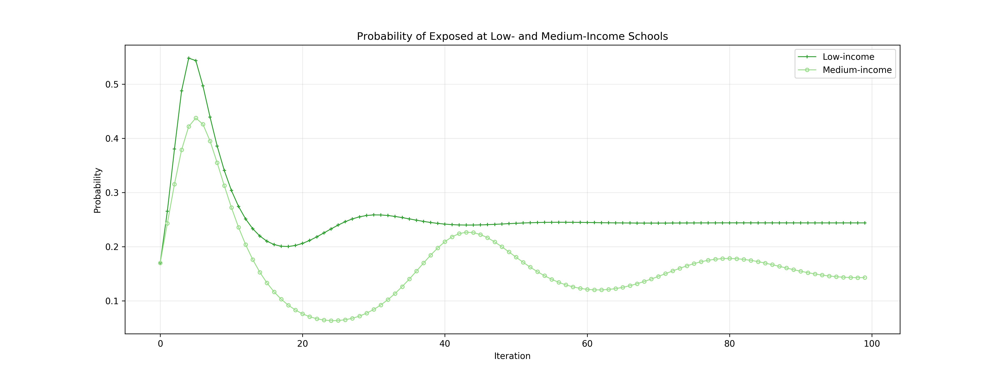
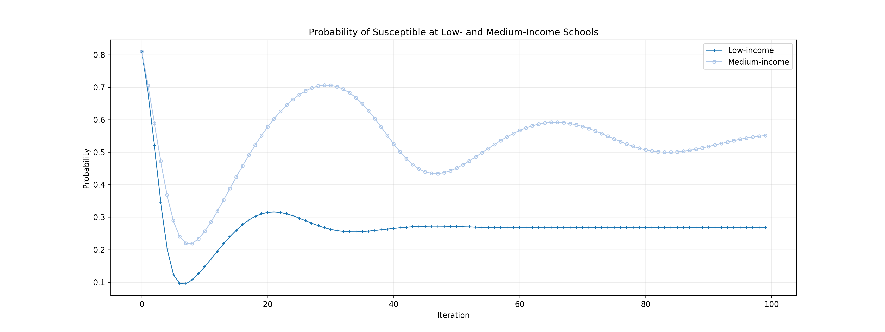
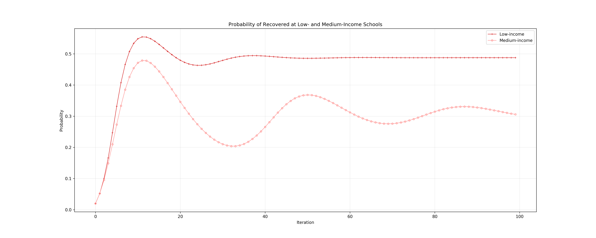

# Probabilistic Relational Agent-based Modeling (PRAM) Framework

A simulation framework that fuses relational probabilistic models and agent-based models.  This software is in the pre-release stage, so feel free to play with it, but keep in mind that not all pieces may be working.  Until there is a release, please don't open issues and flex your own Python muscle to fix problems you encounter.


## Dependencies - The Library
- [Python 3.6](https://python.org)
- [attrs](https://github.com/python-attrs/attrs)
- [scipy](https://www.scipy.org)
- [numpy](https://www.numpy.org)
- [dotmap](https://pypi.org/project/dotmap)


## Dependencies - The Web App
- [Flask](http://flask.pocoo.org)
- [Celery](http://www.celeryproject.org)
- [Redis](https://redis.io)
- [PSUtil](https://github.com/giampaolo/psutil)


## Setup
The following shell script creates a Python virtual environment (`venv`), activates it, downloads the source code of PRAM into it, and installs all dependencies.

```
#!/bin/sh

prj=pram

[[ -d $prj ]] && echo "Directory '$prj' already exists." && exit 1

python3 -m venv $prj
cd $prj
source ./bin/activate

git init
git remote add origin https://github.com/momacs/$prj
git pull origin master

[ -f requirements.txt ] && python -m pip install -r requirements.txt
```

The same result can be achieved with one of the commands of the [`momacs`](https://github.com/momacs/misc) command-line utility.  Another command can be used subsequently to update an existing PRAM `venv` with the latest version of the source code from the present repository.  These two commands are, respectively:
```
momacs pram setup
momacs pram update
```

Once a PRAM `venv` has been activated, running the following will display results of a simple simulation:
```
python src/sim/01-simple/sim.py
```


## Simulation: Flu at Allegheny County Schools

Suppose you want to investigate the impact an infectious disease (such as the flu) may have on two specific types of schools: Those with predominantly low-income students and those with few low-income students.  Specifically, you want to know if an epidemic outbreak is more likely at either of them.  In this section, we briefly examine a simulation that helps to answer this question.  PRAMs can be employed in any domain; this is just an example of how the present package can be used.

This simulation takes the synthetic population of 200,169 students in the Allegheny County, uses it to automatically generate entities (i.e., groups and sites), and apply two hand-forged rules in a 100-iteration PRAM.  The resulting groups cumulatively model functionally equivalent agents and the resulting sites encode locations these agents can be at (here, `home` or `school`).  The two rules define ways in which an agent's flu status affect its behavior and are the source of the dynamics of the simulation.

The simulation results below have been generated by the [res.py](src/sim/demo--2019-04-18/res.py) script and are based on the data collected by the [sim-03-flu-allegheny.py](src/sim/demo--2019-04-18/sim-03-flu-allegheny.py) script (which also contains the rules code).

### The Two Schools Separately

Below are time series of the probability of being in one of the three mutually exclusive and exhaustive flu states: `Susceptible`, `exposed`, and `recovered`.  The first plot shows the time series for the low-income school and is followed by a plot for the medium-income school.  It is obvious that the time series evolve differently at the two locations and the next subsection compares these locations side-by-side.





### The Two Schools Side-by-Side

The plot below compares the low- and medium-income schools directly by plotting the probability of being exposed as a function of time.  Evidently, students in the low-income school are at a higher risk of being exposed to the flu compared to their medium-income school counterparts.  Consequently, an epidemic outbreak seems more likely at a low-income school.  This is the sort of a result that may be difficult to predict but becomes clear via simulation.  This is especially true for complex systems.

Another observation that is much easier to make using this side-by-side comparison is that the initial condition for both schools are identical (at least in terms of the flu status distribution) which suggests that the evident divergence is not due to the starting point.



For completeness, below are the proportions of susceptible and recovered students at either site.





### The Simulation Output

Below is the output of the simulation when it is run synchronously from the terminal.  For brevity, only five-iteration run is shown.

```
[info] Constructing a PRAM
[info] Running static rule analysis
[info]     Relevant attributes found : ['income', 'flu']
[info]     Relevant relations  found : ['school', 'home']
[info] Generating groups from a database (db/allegheny-students.sqlite3; table 'students')
[info]     Expected in table
[info]         Attributes : ['income', 'flu']
[info]         Relations  : ['school_id']
[info]     Found in table
[info]         Attributes : ['income']
[info]         Relations  : ['school_id']
[info]     Not found in table
[info]         Attributes : ['flu']
[info]         Relations  : []
[info]     Fixed manually
[info]         Attributes : {}
[info]         Relations  : {'home': Site(8217927942166902109)}
[info]     Final combination used for group forming
[info]         Attributes fixed      : {}
[info]         Attributes from table : ['income']
[info]         Relations  fixed      : {'home': Site(8217927942166902109)}
[info]         Relations  from table : ['school_id']
[info]     Generated 350 'school' sites from the 'schools' table
[info]     Summary
[info]         Records in table: 200,169
[info]         Groups formed: 696
[info]         Sites formed: 350
[info]         Agent population accounted for by the groups: 200,169
[info] Running group setup
[info] Setting simulation duration
[info] Syncing rule timers
[info] Running rule setup
[info] Compacting the model
[info] Capturing the initial state
[info] Initial population info
[info]     Agents : 200,169
[info]     Groups : 1,392
[info]     Sites  : 351
[info] Running the PRAM
[info] Iteration 1 of 5
[info]     Group count: 1392
[info]     Compacting the model
[info] Iteration 2 of 5
[info]     Group count: 3480
[info]     Compacting the model
[info] Iteration 3 of 5
[info]     Group count: 4176
[info]     Compacting the model
[info] Iteration 4 of 5
[info]     Group count: 4176
[info]     Compacting the model
[info] Iteration 5 of 5
[info]     Group count: 4176
[info]     Compacting the model
[info] Final population info
[info]     Groups: 4,176
[info] Running dynamic rule analysis
[info]     Accessed attributes    : ['income', 'flu']
[info]     Accessed relations     : ['school', 'home', '__at__']
[info]     Superfluous attributes : []
[info]     Superfluous relations  : []
[info] Running rule cleanup
[info] Compacting the model
[info] Finishing simulation
```


## References

Loboda, T.D. (2019) [Milestone 3 Report](https://github.com/momacs/pram/blob/master/docs/Milestone-3-Report.pdf).


## License
This project is licensed under the [BSD License](LICENSE.md).
