# Probabilistic Relational Agent-Based Modeling (PRAM) Framework

A simulation framework that fuses relational probabilistic models and agent-based models.  This software is in the pre-release stage.


## Dependencies - Core Library ([`src/pram`](src/pram))
- [Python 3.6](https://python.org)
- [dotmap](https://pypi.org/project/dotmap)
- [sortedcontainers](http://www.grantjenks.com/docs/sortedcontainers/index.html)
- [attrs](https://github.com/python-attrs/attrs)
- [dill](https://pypi.org/project/dill/)
- [numpy](https://www.numpy.org)
- [scipy](https://www.scipy.org)
- [matplotlib](https://matplotlib.org/)
- [graph-tool](https://graph-tool.skewed.de/)
- [pycairo](https://www.cairographics.org/pycairo/) (for `graph-tool`)
- [PyGObject](https://pygobject.readthedocs.io) (for `graph-tool`)
- [altair](https://altair-viz.github.io)
- [selenium](https://selenium-python.readthedocs.io/) (for saving `altair` graphs)
- [Gecko Driver](https://github.com/mozilla/geckodriver/releases) or [Chrome Driver](https://sites.google.com/a/chromium.org/chromedriver/) and a recent version of either of the respective Web browser (i.e., Firefox or Chrome; for saving `altair` graphs)


## Dependencies - Simulation Library ([`src/sim`](src/sim))
None


## Dependencies - The Web App ([`src/web`](src/web))
Backend:
- [Flask](http://flask.pocoo.org)
- [Celery](http://www.celeryproject.org)
- [Redis](https://redis.io)
- [PSUtil](https://github.com/giampaolo/psutil)

Front-end:
- [Materialize](https://materializecss.com)
- [jQuery](https://jquery.com)
- [Fuse.js](https://fusejs.io)


## Setup
The following shell script creates a Python virtual environment (`venv`), activates it, downloads the source code of PRAM into it, and installs all dependencies.

```
#!/bin/sh

prj=pram

[[ -d $prj ]] && echo "Directory '$prj' already exists." && exit 1

python3 -m venv $prj
cd $prj
source ./bin/activate

git init
git remote add origin https://github.com/momacs/$prj
git pull origin master

[ -f requirements.txt ] && python -m pip install -r requirements.txt
```

The same result can be achieved with one of the commands of the [`momacs`](https://github.com/momacs/misc) command-line utility.  Another command can be used subsequently to update an existing PRAM `venv` with the latest version of the source code from the present repository.  These two commands are, respectively:
```
momacs pram setup
momacs pram update
```

Once a PRAM `venv` has been activated, running the following will display results of a simple simulation:
```
python src/sim/01-simple/sim.py
```

Note that installing the `graph-tool` library is the only hard part.  Because it is a C++ software and the installation is system-dependent, there is no easy way for us to provide much assistance.  Please refer to the [documentation](https://graph-tool.skewed.de/).


## Flu at Allegheny County Schools: An Example of a PRAM Simulation

Suppose you want to investigate the impact an infectious disease (such as the flu) may have on two specific types of schools: Those with predominantly low-income students and those with few low-income students.  Specifically, you want to know if an epidemic outbreak is more likely at either of them.  In this section, we briefly examine a simulation that helps to answer this question.  PRAMs can be employed in any domain; this is just an example of how the present package can be used.

This simulation takes the synthetic population of 200,169 students in the Allegheny County, uses it to automatically generate entities (i.e., groups and sites), and apply two hand-forged rules in a 100-iteration PRAM.  The resulting groups cumulatively model functionally equivalent agents and the resulting sites encode locations these agents can be at (here, `home` or `school`).  The two rules define ways in which an agent's flu status affect its behavior and are the source of the dynamics of the simulation.

The simulation results below have been generated by the [`res.py`](src/sim/demo--2019-04-18/res.py) script and are based on the data collected by the [`sim-03-flu-allegheny.py`](src/sim/demo--2019-04-18/sim-03-flu-allegheny.py) script (which also contains the rules code).

### The Two Schools Separately

Below are time series of the probability of being in one of the three mutually exclusive and exhaustive flu states: `Susceptible`, `exposed`, and `recovered`.  The first plot shows the time series for the low-income school and is followed by a plot for the medium-income school.  It is obvious that the time series evolve differently at the two locations and the next subsection compares these locations side-by-side.


### The Two Schools Side-by-Side

The plot below compares the low- and medium-income schools directly by plotting the probability of being exposed as a function of time.  Evidently, students in the low-income school are at a higher risk of being exposed to the flu compared to their medium-income school counterparts.  Consequently, an epidemic outbreak seems more likely at a low-income school.  This is the sort of a result that may be difficult to predict but becomes clear via simulation.  This is especially true for complex systems.

Another observation that is much easier to make using this side-by-side comparison is that the initial condition for both schools are identical (at least in terms of the flu status distribution) which suggests that the evident divergence is not due to the starting point.


For completeness, below are the proportions of susceptible and recovered students at either site.


### The Simulation Output

Below is the output of the simulation when it is run synchronously from the terminal.  For brevity, only five-iteration run is shown.

```
[info] Constructing a PRAM
[info] Running static rule analysis
[info]     Relevant attributes found : ['income', 'flu']
[info]     Relevant relations  found : ['school', 'home']
[info] Generating groups from a database (db/allegheny-students.sqlite3; table 'students')
[info]     Expected in table
[info]         Attributes : ['income', 'flu']
[info]         Relations  : ['school_id']
[info]     Found in table
[info]         Attributes : ['income']
[info]         Relations  : ['school_id']
[info]     Not found in table
[info]         Attributes : ['flu']
[info]         Relations  : []
[info]     Fixed manually
[info]         Attributes : {}
[info]         Relations  : {'home': Site(8217927942166902109)}
[info]     Final combination used for group forming
[info]         Attributes fixed      : {}
[info]         Attributes from table : ['income']
[info]         Relations  fixed      : {'home': Site(8217927942166902109)}
[info]         Relations  from table : ['school_id']
[info]     Generated 350 'school' sites from the 'schools' table
[info]     Summary
[info]         Records in table: 200,169
[info]         Groups formed: 696
[info]         Sites formed: 350
[info]         Agent population accounted for by the groups: 200,169
[info] Setting simulation duration
[info] Syncing rule timers
[info] Running group setup
[info] Running rule setup
[info] Compacting the model
[info] Capturing the initial state
[info] Initial population info
[info]     Agents : 200,169
[info]     Groups : 1,392
[info]     Sites  : 351
[info] Running the PRAM
[info] Iteration 1 of 5
[info]     Group count: 1392
[info]     Compacting the model
[info] Iteration 2 of 5
[info]     Group count: 3480
[info]     Compacting the model
[info] Iteration 3 of 5
[info]     Group count: 4176
[info]     Compacting the model
[info] Iteration 4 of 5
[info]     Group count: 4176
[info]     Compacting the model
[info] Iteration 5 of 5
[info]     Group count: 4176
[info]     Compacting the model
[info] Final population info
[info]     Groups: 4,176
[info] Running dynamic rule analysis
[info]     Accessed attributes    : ['income', 'flu']
[info]     Accessed relations     : ['school', 'home', '__at__']
[info]     Superfluous attributes : []
[info]     Superfluous relations  : []
[info] Running rule cleanup
[info] Compacting the model
[info] Finishing simulation
```


## Modeling Levels

PRAM supports modeling on three levels of abstraction: Domain, class, and rule.  Apart from being flexible, this design choice delivers expressive brevity in that it allows the modeler to invoke models in a space- and time-efficient manner.  In what follows, we briefly describe an example model and then demonstrate how that model can be implemented on each of the three level.

### The SIRS Model

The SIR epidemiological model (Kermack & McKendrick, 1927) will help us illustrate the differnt modeling levels.  In that model, population is compartmentalized into susceptible (S), infectious (I), and recovered (R).  As shown on the image below, an infectious disease is transmitted between susceptible hosts with the rate _&beta;_ who eventually recover with rate _&gamma;_.  Because getting a disease does not need to result in life-long immunity to it, the model can be augmented by allowing recovered hosts to become susceptible again with rate _&alpha;_ (which results in the SIRS model).

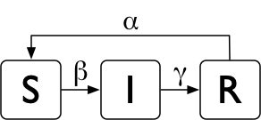

### The Domain Level

The domain level allows the modeler to express their models on the level of their research area.  For example, being familiar with the different models of infectious diseases, it would be natural for an epidemiologist to invoke a model like the SIRS directly.  Here is a Python example of just that:

```python
SIRSModel('flu', β=0.05, γ=0.50, α=0.10)
```

### The Class Level

A modeler can also work on the class-of-models level.  For example, an epidemiologist may know that the SIRS model can be implemented as a time-invariant Markov chain.  Here is an example of how that can be coded in the `pram` package using the `TimeInvMarkovChain` rule:

```python
β, γ, α = 0.05, 0.50, 0.10
transition_matrix = {
    's': [1 - β,     β,  0.00],
    'i': [ 0.00, 1 - γ,     γ],
    'r': [    α,  0.00, 1 – α]
}
TimeInvMarkovChain('flu', transition_matrix)
```

### The Rule Level

Finally, a modeler may choose to descend to the lowest level and implement the dynamics of their model directly.  This is beneficial if what they are trying to express diverges from the set of modeling classes `pram` provides (or to encode a particular sort of interaction between different models).  Extending an existing class (e.g., the `TimeInvMarkovChain`) is an example of modeling on the rule level as well even if minimal portions of the model dynamics are overridden.  Here is a pseudo-code for the (slightly extended) SIRS model:

```
rule_flu_progression():
    if group.feature.flu == 's':
        p_inf = n@_{feature.flu == 'i'} / n@    # n@ - count at the group's location
        dm     p_inf -> F:flu = 'i', F:mood = 'annoyed'
        nc 1 - p_inf
    if group.feature.flu == 'i':
        dm 0.2 -> F:flu = 'r', F:mood = 'happy'
        dm 0.5 -> F:flu = 'i', F:mood = 'bored'
        dm 0.3 -> F:flu = 'i', F:mood = 'annoyed'
    if group.feature.flu == 'r':
        dm 0.1 -> F:flu = 's'    # dm - distribute mass
        nc 0.9                   # nc - no change

rule_flu_location():
    if group.feature.flu == 'i':
        if group.feature.income == 'l':
            dm 0.1 -> R:@ = group.rel.home
            nc 0.9
        if group.feature.income == 'm':
            dm 0.6 -> R:@ = group.rel.home
            nc 0.4
    if group.feature.flu == 'r':
      dm 0.8 -> R:@ = group.rel.school
      nc 0.2
```

This pseudo-code is based on a Python-like notation we have been working on to help to expose the internal workings of a model without resorting to often unnecessarily verbose Python source code.


## Ordinary Differential Equations

### Mass Space

`pram` supports simulating systems of odrinary differential equations (ODEs) operating on three types of spaces.  First, systems of ODEs can be used as mass conversion operators.  For example, the image below shows the conversion of mass for two substances, A and B, described by the exponential decay equation (i.e., _dN/dt = -&lambda;N_).  The decay constants for the two substances are _&lambda;<sub>A</sub> = 1_ and _&lambda;<sub>B</sub> = 0.05_.

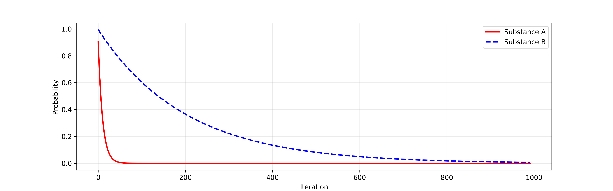

As another example, the time series below shows the result of simulating a system of ODEs describing the SIR model.

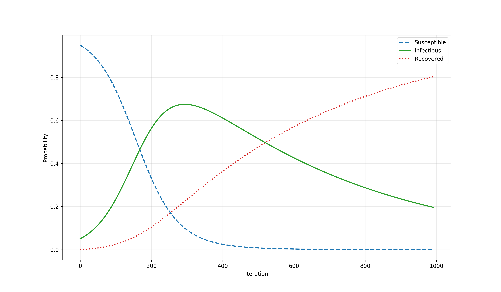

### Group Space

The second space which can be affected by a system of ODEs is given by groups.  Because groups are defined by the values of their attributes and relations, this results in mass conversion (or flow) between groups, but the machanism by which this occurs is different than when the ODEs operate on the mass space.

The time series below shows the result of simulating the Lotka-Volterra population dynamics model.  That model expresses the cyclic relationship between the size of prey population that grows via reproduction and the size of predator population which grows by consuming the prey.

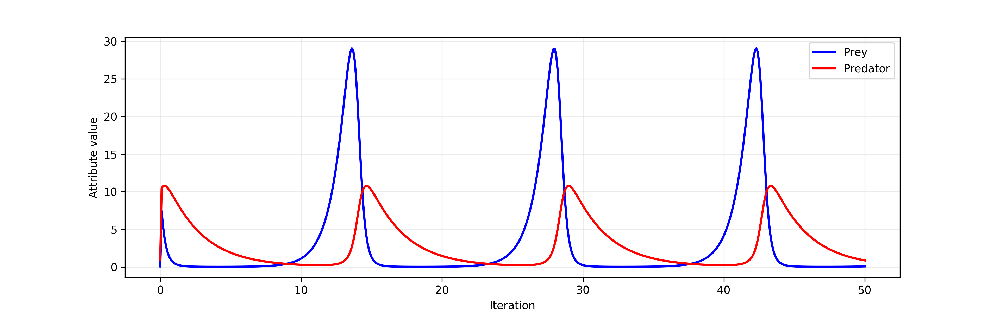

### Rule Space

Finally, the numeric integrator for a system of ODEs can be kept internal to the PRAM rule.  In that case, it does not interact with the simulation context directly.  Nevertheless, the results of the integration are available to all other rules.  For example, the image below shows the phase plot of atmospheric convection modeled with three ODEs that form the Lorenz system.  The solution to this particular initial value problem is the Lorenz attractor.

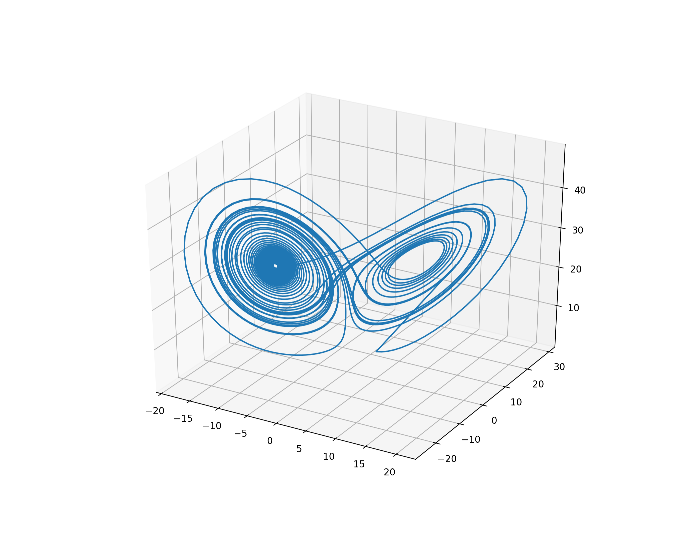


## Composite Simulations

One of the goals of the `pram` package is to elucidate the interactions between complex systems.  It hopes to do that via composite simulations, i.e., simulations composed of different models which are allowed to work independently and interact by simultaniosuly changing the shared simulation state space.

### The SIR Model with a Flu-Spike Event

The time series below is a result of a simulation combining the SIR model with an event (i.e., a time-point perturbation).  That event converts a large proportion (specifically, 80%) of the recovered agents back into susceptible.

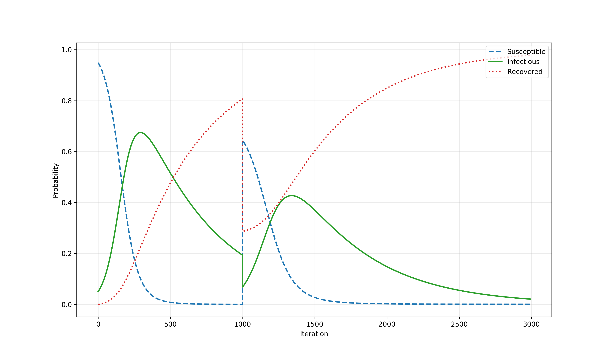

### The SIR Model with a Flu-Spike Process

A more interesting and realistic scenario might involve not an event but a process (i.e, a time-span perturbation).  For example, the time series below shows the intensity of a process described by the scaled gamma distribution.


When this gamma process is combined with the SIR model, the PRAM simulation produces a time series shown on the image below.  Iterations 1-999 are dominated by the SIR model which converts mass from S to R via I (i.e., susceptible to recovered via infectious).  However, from that point on (i.e., for iterations of 1000-3000), additionally to that model, the gamma process shown above converts a portion of the recovered agents back into susceptible.  As shown on the plot below, the interplay of the two `pram` rules (with the SIR model dynamics being encoded by a system of ODEs) produces an interesting effect of the infection level in the population being stretched in time plausibly resulting in a model of a long-term epidemic.

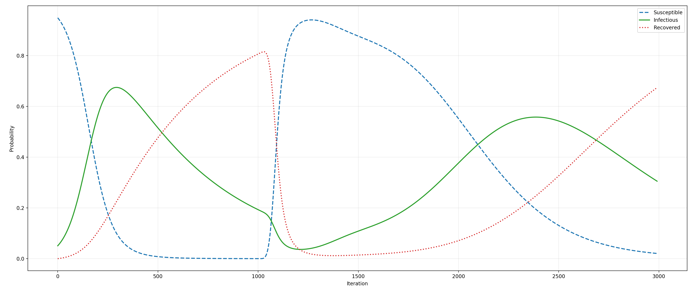

### The Lotka-Volterra Model with a Food Restriction Process

The Lotka-Volterra model of population dynamics contains four paratemers.  When one of them, the prey reproduction rate parameter, is affected by a linear process that decreases it slowly but surely, the following picture emerges.

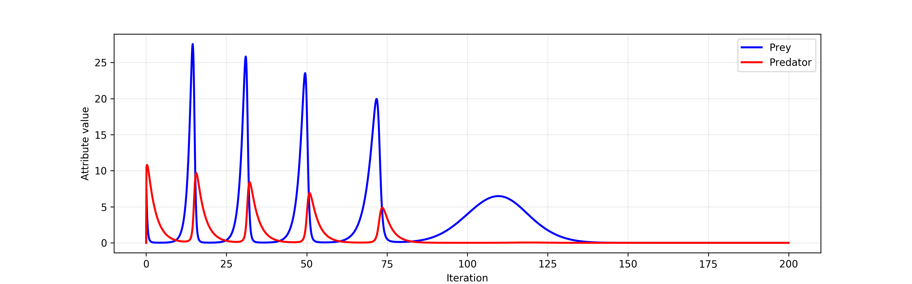

By decreasing the reproductive rate of prey, that linear process models increasingly hostile natural environment.  The process does not directly disturb the sizes of the two populations and affects the population dynamics indirectly (plausibly by restricting the prey food sources).  While using such a simple process is perfect for expositionary purposes, a more realistic model would involve breaking the linear process down into sub-processes, each corresponding to the dynamics of an asymptotically barren ecosystem.

Even though the process changes the prey reproductive parameter in very small decrements, it nevertheless leads to the eventual extinction of the predator population (due to insufficient size of the prey population) and then the prey population itself.  If we assume that the simulation parameters are biologically and ecologically valid, this simulation predicts the predator species to go extinct in 80 years and the prey population to follow in another 50 years.


## Mass Dynamics

In the context of a PRAM simulation, mass dynamics can be defined in at least three related but distinct ways.  First, we could understand it as mass locus (_m_); such conceptualization would allows us to answer the question "Where is mass?"  Second, we could define it as mass flow (i.e., the first derivative of mass locus, _dm/dt_) which would permit answers to the question "How did it get there?"  Finally, we could talk of the mass flux (or rate of mass flow, i.e., first derivative of mass transfer and the second derivative of mass locus, _d<sup>2</sup>m/dt_).  The rate answers the question "How quickly did it move?"

### Mass Spaces

Mass dynamics in PRAMs can be considered in the _group space_ or the _probe space_.  The group mass space is a partition defined by group attributes and relations and thus contains all the groups in a simulation (for that reason, the name _simulation mass space_ would be adequate as well).  The probe mass space on the other hand is typically smaller (i.e., it has fewer dimensions) because the mass distributed among the groups is typically aggregated by probes.  For example, while the SIR model can be invoked in a simulation containing many agents attending many schools, a probe defined by the user will reveal their interest to be on a high level of, e.g., "size of populations of infected students at low vs medium income schools over time."

### Mass Locus

Below are a few examples of how mass locus can be visualized using steamgraphs.  First, we have the SIR model which was described earlier.


Next, we have a simulation of the SIR model composed with a gamma process which at iteration 1000 starts to convert recovered agents back into susceptible.  That gamma process quickly overpowers the SIR model's attempts to convert agents into recovered (via infectious) but then eases off and eventually play no role.

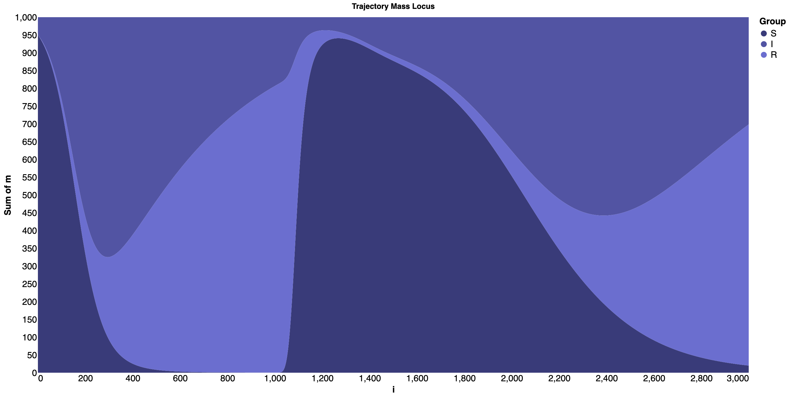

Next, we have the segregation model (Schelling, 1969) in which mass dynamics is the result of the agents' motivation to be close to other similar agents (e.g., blue agents want to be in proximity of other blue agents) and far away from dissimilar agents (e.g., blue agents do not want to congregate near red agents).


Finally, we have a simulation of the SIR model at eight different schools.  The SIR models at each of those schools are slightly different in that the transmission probability depends on the size of the school, i.e., the probability of a student to become infected is proportional to the number of infectious students around him.  In that way, larger schools are more likely to be afflicted by an epidemic.

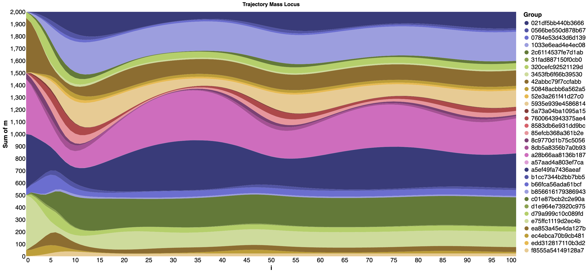


### Mass Flow

Below is an example of visualization of mass flow in the SIR model that has been run for seven iterations.

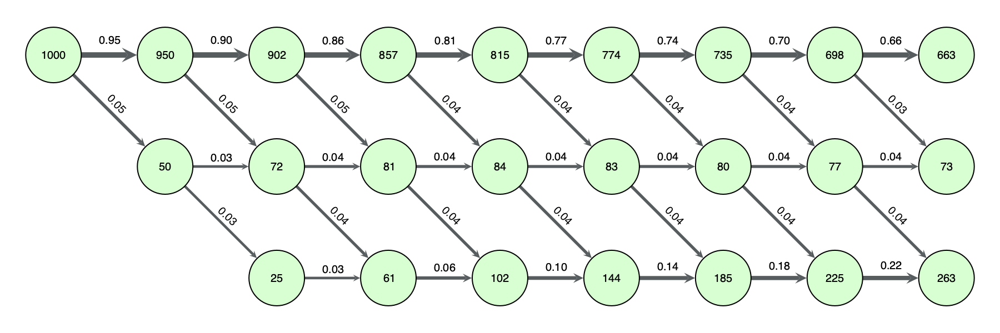


## Trajectories and Trajectory Ensembles

A PRAM simulation need not to be deterministic.  In fact, simulations imbued with stochasticity are likely the more interesting kind.  In order to properly account for a stochastic nature of those simulations, the software enables execution of multiple independent simulations.  The trace of those simulation runs yields an ensemble distribution which can then be inspected statistically for patterns (e.g., the expected number of years until underground water wells dry up in a region given water utilization strategies S1 versus S2 or the worst-case scenario under a set of utilization strategies).  Because the states of individual simulations can be conceived as sequential interacting samples of the system state, this method belongs to the mean field particle class.  While beginning with a set of user-defined or random initial states (or a combination thereof) is the simplest solution, a more elaborate initial state selection could be employed as well.

### Example: The SIRS Model + Beta Perturbation

Let us illustrate this idea with a simulation of two interacting models.  The first model is the SIRS model.  The second model is a stochastic process that at every simulation step converts a small portion of the recovered agents back into susceptible.  That random conversion probability is a random draw from the Beta(2,25) distribution.  Below is the histogram of 100,000 such draws.


While the result of these two models interacting is fairly easy to anticipate, this may not be the case for larger systems of models.  Below is a line plot of 10 randomly selected trajectories of this ensemble.  Note that the actual data is not smooth; the plot represents splines fitted to each of the three series within each of the 10 trajectories.

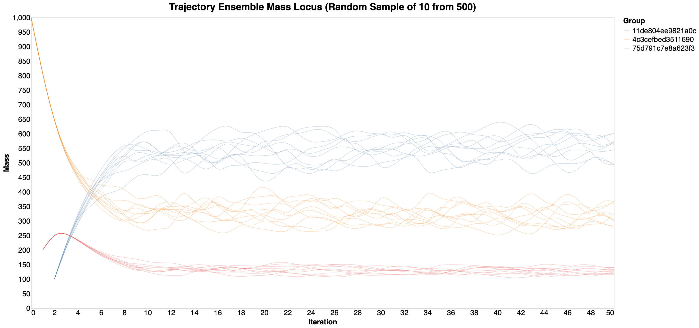

This is how a 100 samples would look like.

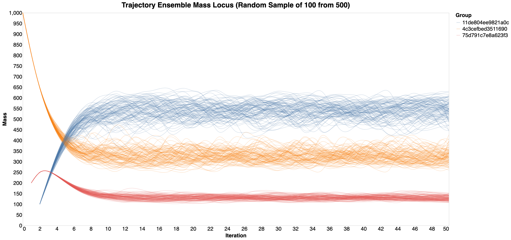

### Example: The SIRS Model + Beta Perturbation + Gamma Process

In this example, we will investigate a simulation consisting of the same SIRS model and a beta perturbation but this time there will also be a gamma process which, like before, converts an increasingly large number of recovered agents into the susceptible ones only to ease off and eventually cease to affect the simulation altogether.  Below is mass dynamics for an ensemble of 10 trajectories.


Because directly plotting large number of individual trajectories may not produce a clear image, trajectories can be aggregated over.  One example of such aggregation is shown below.  Here, the mean and the interquartile range (IQR) for each of the three groups (i.e., S, I, and R) is shown instead of the individual series.

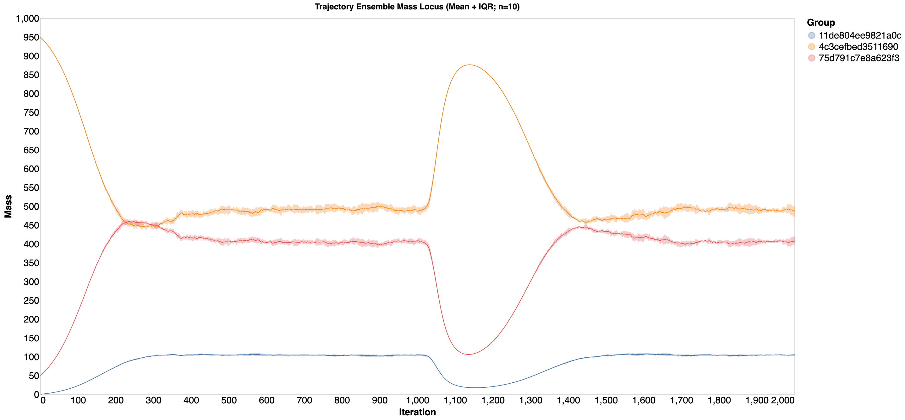


## Web App

The Web app located in the [`src/web`](src/web/) directory demonstrates how the `Simulation` object can be used asynchronously via a Web user interface.  A production-grade server-side logic handles client requests.  As shown of the screenshots below, the UI itself is organized into a logical sequence of five sections: Rules, Population, Probes, Simulation, and Output.

The first figure below shows the results of syntactic rule analysis which discovers two relevant attributes (i.e., `income` and `flu`) and two relevant relations (i.e., `home` and `school`).  The second figure shows generating populations from a database.  The UI assists the user by suggesting attributes and relations to be used for forming groups by fuzzy-matching the database table column names against the sets of relevant attributs and relations.  For example, at least one rule makes use of the relation `school` and the UI suggests to form groups based on the foreign key column `school_id` due to the fuzzy-matching score of the two strings being high enough (`0.67`).


## References

Cohen, P.R. & Loboda, T.D. (2019) Probabilistic Relational Agent-Based Models.  _International Conference on Social Computing, Behavioral-Cultural Modeling & Prediction and Behavior Representation in Modeling and Simulation (BRiMS)_, Washington, DC, USA.  [PDF](https://github.com/momacs/pram/blob/master/docs/cohen-2019-brims.pdf)

Kermack, W.O. & McKendrick, A.G. (1927) A Contribution to the Mathematical Theory of Epidemics. _Proceedings of the Royal Society A. 115(772)_, 700-721.

Loboda, T.D. (2019) [Milestone 3 Report](https://github.com/momacs/pram/blob/master/docs/Milestone-3-Report.pdf).

Loboda, T.D. & Cohen, P.R. (2019) Probabilistic Relational Agent-Based Models.  Poster presented at the _International Conference on Social Computing, Behavioral-Cultural Modeling & Prediction and Behavior Representation in Modeling and Simulation (BRiMS)_, Washington, DC, USA.  [PDF](https://github.com/momacs/pram/blob/master/docs/loboda-2019-brims.pdf)

Schelling, T.C. (1969) Models of Segregation. _The American Economic Review, 59(2)_, 488-493.


## License
This project is licensed under the [BSD License](LICENSE.md).
